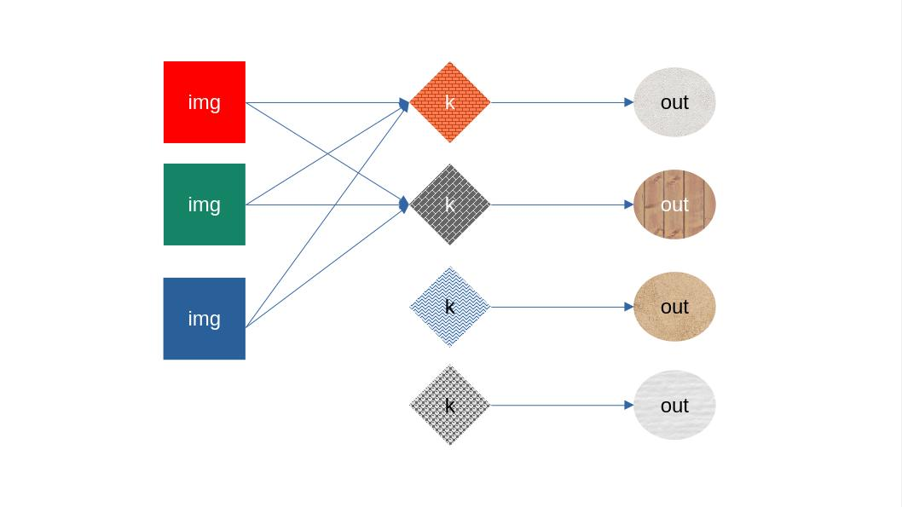

# Convolução 2D

Trocar alocação estática por dinâmica (usar `malloc`).

Adicionar canais na convoluçaão 2D, tanto na entrada quanto no kernel.

Exemplo gráfico de Convolução 2D:



Abaixo exemplos da possíveis alterações no código, lembrando que eles podem conter erros.

Example de `define`:

```c
#define TAM_CANAL_ENTRADA 3
#define TAM_CANAL_SAIDA 3
#define TAM_ENTRADA 3
#define TAM_KERNEL 2
#define TAM_SAIDA (TAM_CANAL_SAIDA * (TAM_ENTRADA - TAM_KERNEL + 1))
```

Ordenação dos dados de uma entrada em 2D, é um array 1D, com 3 canais, 4 linhas por 4 colunas. A ordenação é do array é `[TOTAL DE CANAIS, LADO DA IMAGEM, LADO DA IMAGEM]`.

```c
int entrada1D = {
  // Canal R
  34, 67, 89, 120,
  5, 144, 227, 12,
  200, 42, 58, 78,
  99, 233, 156, 22,
  // Canal G
  4, 11, 36, 75,
  150, 200, 255, 15,
  30, 55, 93, 111,
  78, 189, 218, 49,
  // Canal B
  220, 125, 48, 85,
  36, 19, 67, 102,
  18, 23, 150, 170,
  88, 240, 2, 90
}
```

Declaração de variáveis:

```c
int entrada1D[TAM_CANAL_ENTRADA* TAM_ENTRADA* TAM_ENTRADA];
int kernel1D[TAM_CANAL_SAIDA * TAM_KERNEL* TAM_KERNEL];
```

Alteração no loop da convolução:

```c
    for (int e = 0; e < TAM_CANAL_ENTRADA; e++)
    {
        for (int s = 0; s < TAM_CANAL_SAIDA; s++)
        {
            for (int i = 0; i < TAM_SAIDA; i++)
            {
                for (int j = 0; j < TAM_SAIDA; j++)
                {
                    int soma = 0;
                    for (int l = 0; l < TAM_KERNEL; l++)
                    {
                        for (int c = 0; c < TAM_KERNEL; c++)
```
